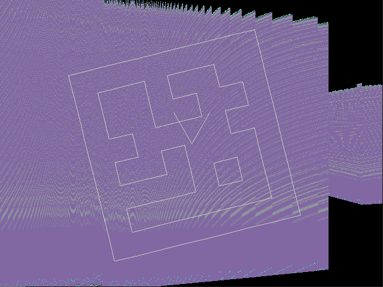
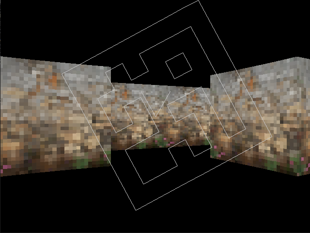

# kev_lib

Homebrew Cross-platform C libraries

For Windows and Linux. Tested on Windows 10 and Xubuntu.

Libraries:
- *kev_dict: unused experiment*
- kev_img: TGA image loader, currently only supports type 2 (uncompressed 24-bit RGB)
- *kev_matrix: non-functional stub*
- kev_perf_timer: wrapper around Win32 and Linux timing methods
- kev_render: 2D software renderer with line drawing, digits for debug info, and image blitting, currently 32-bit colour only
- kev_test: basic working test library using longjmp
- kev_winter: cross-platform window with keyboard input

Projects:
- kev_caster_2: ray caster
- kev_winter_example: animation example

Here's a cool glitch in the raycaster:

Here it is actually working (boring):

To-do:
- Fix bug where the byte 1Ax crashes TGA loading
- Harmonise whitespace
- Be consistent with built-in type usage (uint32_t/unsigned int, float/double)
- Extract kev_caster_2 to another library (so it can be tested similarly to the others)
- Make line-drawing start in the middle of the pixel so starts of lines look better
- Add line-drawing with float coords
*For kev_caster_2...*
- make a more attractive texture
- automap toggleable and lower on screen
- toggleable debug text (centre ray angle, frame rate)
- use transformation matrices... what stymied the first attempt was thinking of a struct for matrices